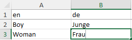

## Minecraft Heads v2.0 - API Translations
The translations stored in this repository are used for the Minecraft Heads v2.0 API.

The folder "lang" includes the translations as .xlsx files for an easy edit as a single source of truth. 

The folder "compiled" includes compiled translations for an internal usage. 

## Want to contribute?
If you would like to make additions, please contact us before making a pullrequest: 

New languages are possible ofc. 

Just let us know so we can initiate it.

## How to contribute?
When initializing a new language, we provide a first draft translated by deepl. 

After this initial translation, you can start to improve the translation. Deepl sometimes have inconsistencies in the translations which can only be fixed manually.

If you would like to contribute, clone the repository locally or download the file you would like to edit manually if you're not familir with Github. 

If you start working on the translations in the .xlsx files: Use the second column for your translations:

In order to add your contributions, commit the modified .xlsx files or send them to us via Discord. 

Modified .json files will be overridden, so please only send us modified .xlsx files.

We can implement them for you then.

## Supported languages
||Key|Language|Categories|Tags|Custom Heads|Contributors|
|---|---|---|---|---|---|---|
||en|English| 
100%
| 
100%
| 
100%
|---|
||ar|Arabic| 
100%
| 
100%
| 
99%
|---|
||bg|Bulgarian| 
100%
| 
100%
| 
99%
|---|
||zh|Chinese (simplified)| 
100%
| 
0%
| 
99%
|---|
||da|Danish| 
100%
| 
0%
| 
0%
|---|
||nl|Dutch| 
100%
| 
100%
| 
99%
|Daniya|
||et|Estonian| 
100%
| 
0%
| 
0%
|---|
||fi|Finnish| 
100%
| 
0%
| 
0%
|---|
||fr|French| 
100%
| 
100%
| 
99%
|---|
||de|German| 
100%
| 
100%
| 
100%
|LordRazen|
||el|Greek| 
100%
| 
0%
| 
0%
|---|
||hu|Hungarian| 
100%
| 
0%
| 
0%
|---|
||id|Indonesian| 
100%
| 
0%
| 
0%
|---|
||it|Italian| 
100%
| 
100%
| 
99%
|---|
||ja|Japanese| 
100%
| 
0%
| 
0%
|---|
||ko|Korean| 
100%
| 
0%
| 
0%
|---|
||lv|Latvian| 
100%
| 
0%
| 
0%
|---|
||lt|Lithuanian| 
100%
| 
0%
| 
0%
|---|
||no|Norwegian| 
100%
| 
0%
| 
0%
|---|
||pl|Polish| 
100%
| 
0%
| 
0%
|---|
||pt|Portuguese| 
100%
| 
0%
| 
0%
|Pastel de N4ta|
||ro|Romanian| 
100%
| 
0%
| 
0%
|---|
||ru|Russian| 
100%
| 
4%
| 
0%
|Marjory|
||sk|Slovak| 
100%
| 
0%
| 
0%
|---|
||sl|Slovenian| 
100%
| 
0%
| 
0%
|---|
||es|Spanish| 
100%
| 
100%
| 
99%
|---|
||sv|Swedish| 
100%
| 
0%
| 
0%
|---|
||tr|Turkish| 
100%
| 
0%
| 
0%
|---|
||uk|Ukrainian| 
100%
| 
0%
| 
0%
|---|

Thank you to all the translators who contributed new translations and helped make the project accessible to more people around the world. ❤️

~Minecraft-Heads Team